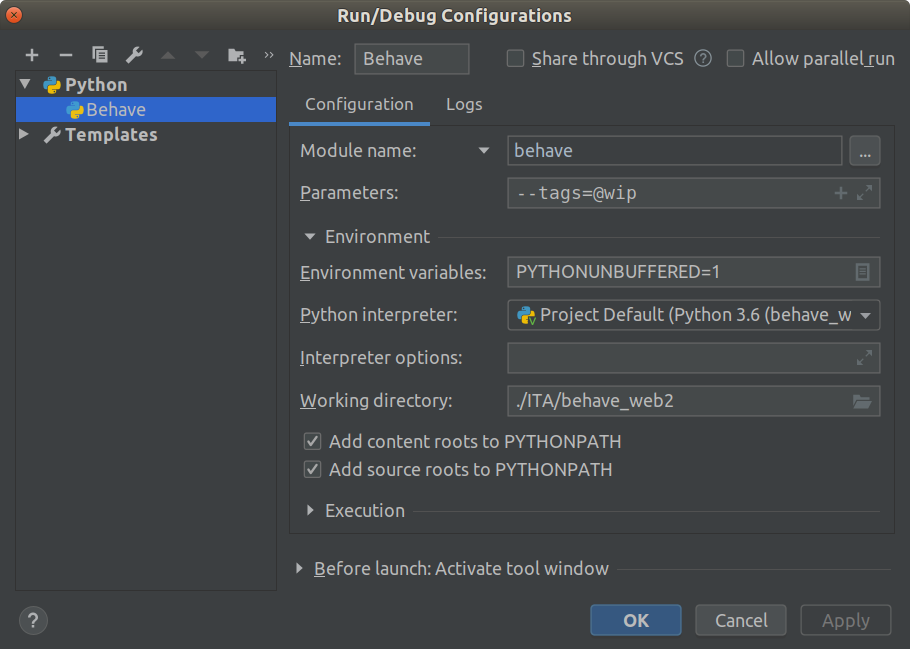

# Behave Web Selenium demo

## Prerequisites
* Python 3.5, pip

## Installation
The project provides test examples.
To prepare local installation, use the following command

    pip install -r requirements.txt

## Usage
To run behave features, use command

    behave

To run in Pycharm Community, use @wip tag to select scenarios and following configuration:

to see console output, use

    behave --no-capture
